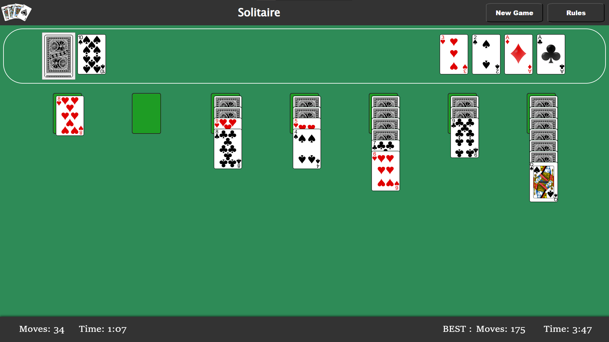
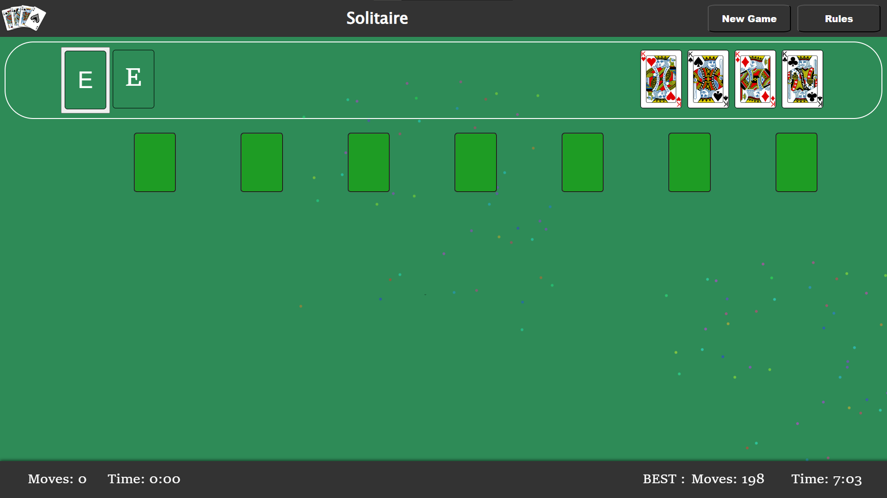
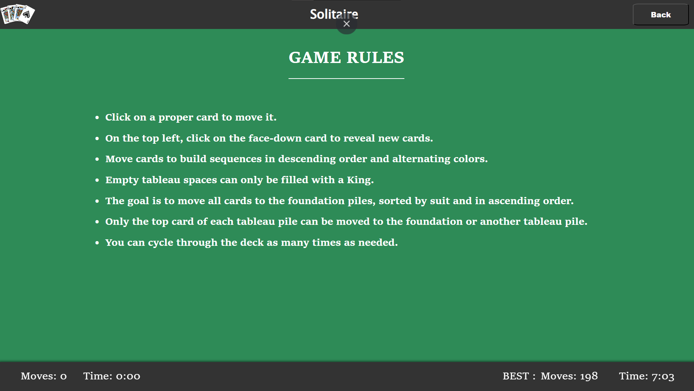
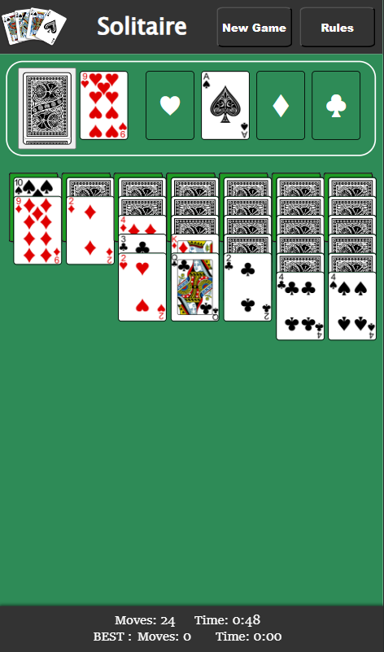
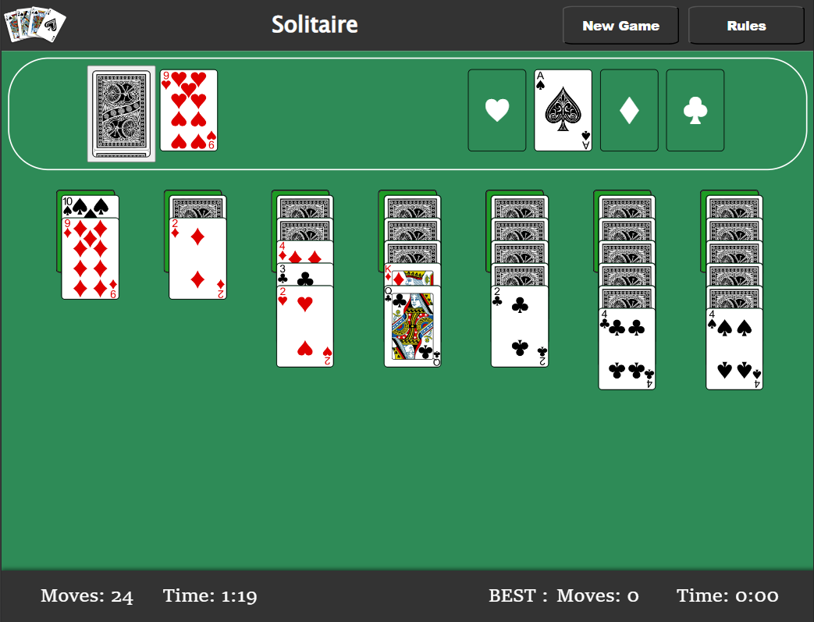

# Solitaire Game

## Description
This project is a digital adaptation of the classic solitaire card game built using modern web technologies. It features a responsive and interactive user interface, leveraging HTML, CSS for styling, JavaScript for interactivity, React JS for component-based UI development, Redux for efficient state management, and React Router for navigation.

## Features

- **Responsive Design**: Optimized for various screen sizes and devices.
- **Redux State Management**: Centralized state management for maintaining game state and logic.
- **Scoreboard**: Tracks and displays the player's score and time.
- **Persistence**: Uses local storage to save the scores, allowing players to continue games later.

## Preview Link 
https://solitairebypj.netlify.app/

## Screenshots

### Game Mode

### Victory

### RULES

### Responsive Design
#### Mobile View

#### Tablet View

## Technologies Used

- **React JS**: Component-based UI development.
- **Redux**: Predictable state container for managing application state.
- **React Router**: Declarative routing for navigating between game screens.
- **HTML/CSS**: Structure and styling of the game interface.
- **JavaScript**: Logic implementation for game rules and interactivity.

## Thank You
By -: PRANAV JARANDE